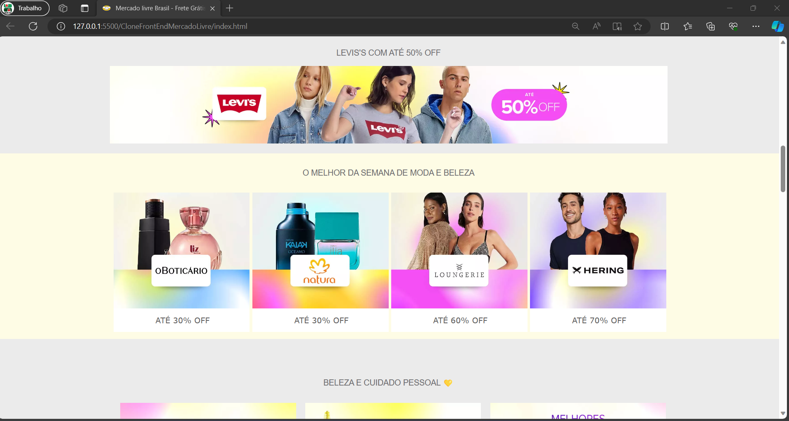

# Clone do site do Mercado Livre. 🛒 

Este projeto tem como objetivo de recriar a pagina inicial do Mercado Livre utilizando HTML e CSS. Abaixo, segue o link do projeto e a pasta das imagens do site em que ele foi baseado. Também estão incluídas algumas das imagens do site do Mercado Livre que servem de referência para o projeto.

  <h3>Imagens do projeto final</h3>
  
  
  

  <h3>Imagens do site Original.</h3>
  
  
  

